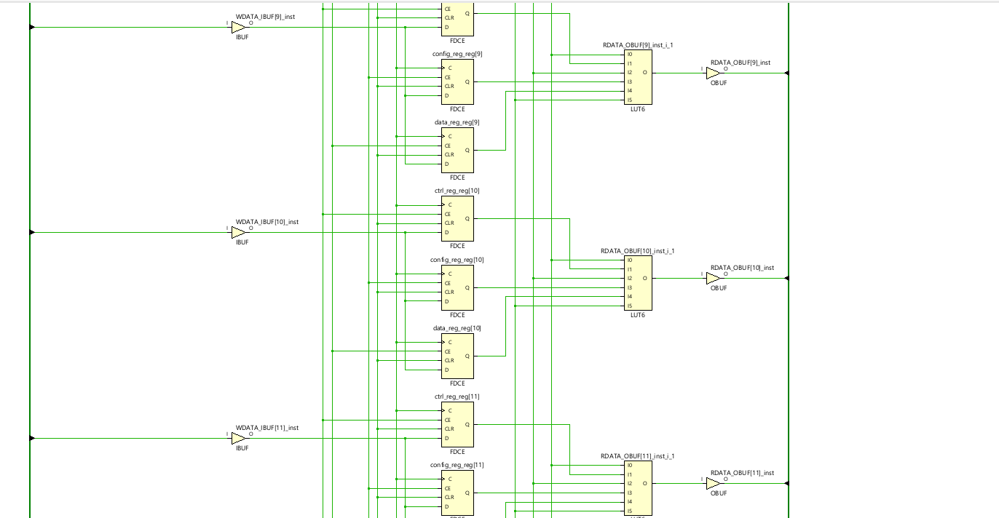
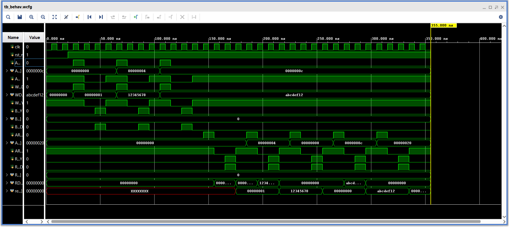
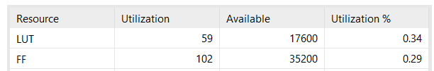

# AXI4-Lite Slave Interface Controller

A simplified **AXI4-Lite Slave Interface Controller** designed in **SystemVerilog** to demonstrate industry-standard SoC bus communication, register mapping, finite state machine (FSM) design, and RTL verification. The design supports memory-mapped register read/write operations through AXI4-Lite handshaking and was functionally verified using a directed, self-checking testbench in **AMD Vivado**.

---

## Project Objectives

- Understand and implement the AXI4-Lite protocol
- Design separate read and write channel finite state machines
- Build a memory-mapped register interface
- Implement address decoding logic
- Apply READY/VALID handshake mechanisms correctly
- Verify RTL functionality using a self-checking testbench
- Synthesize the design and analyze FPGA resource utilization

---

## Features

- Independent Write and Read FSMs
- AXI4-Lite READY/VALID handshake implementation
- Memory-mapped register architecture
- Address decoding logic
- Four 32-bit registers
- Read-only STATUS register with write protection
- Self-checking directed verification testbench
- Behavioral simulation and synthesis using AMD Vivado

---

## Register Map

| Address | Register | Access | Description             |
|--------:|----------|:------:|--------------------------|
| `0x00`  | CTRL     | R/W    | Control register         |
| `0x04`  | CONFIG   | R/W    | Configuration register   |
| `0x08`  | STATUS   | RO     | Status register          |
| `0x0C`  | DATA     | R/W    | Data register            |

---

## AXI4-Lite Interface

### Write Address Channel

| Signal  | Description                       |
|---------|------------------------------------|
| AWVALID | Indicates a valid write address    |
| AWREADY | Slave is ready to accept address   |
| AWADDR  | Write address                      |

### Write Data Channel

| Signal | Description                  |
|--------|-------------------------------|
| WVALID | Indicates valid write data    |
| WREADY | Slave is ready to accept data |
| WDATA  | Write data                    |

### Write Response Channel

| Signal | Description               |
|--------|----------------------------|
| BVALID | Write response is valid    |
| BREADY | Master accepts the response|
| BRESP  | Write response (`OKAY`)    |

### Read Address Channel

| Signal  | Description                       |
|---------|------------------------------------|
| ARVALID | Indicates a valid read address     |
| ARREADY | Slave is ready to accept address   |
| ARADDR  | Read address                       |

### Read Data Channel

| Signal | Description             |
|--------|--------------------------|
| RVALID | Read data is valid       |
| RREADY | Master accepts the data  |
| RDATA  | Read data                |
| RRESP  | Read response (`OKAY`)  |

---

## Finite State Machines

### Write FSM

```text
          +-------+
          | IDLE  |
          +-------+
              |
      AWVALID & WVALID
              |
              v
         +-----------+
         |  WRITE    |
         +-----------+
              |
              v
        +------------+
        | RESPOND    |
        +------------+
              |
           BREADY
              |
              v
          +-------+
          | IDLE  |
          +-------+
```

### Read FSM

```text
          +-------+
          | IDLE  |
          +-------+
              |
           ARVALID
              |
              v
         +----------+
         |  READ    |
         +----------+
              |
              v
        +------------+
        | RESPOND    |
        +------------+
              |
           RREADY
              |
              v
          +-------+
          | IDLE  |
          +-------+
```
### RTL Schematic



---

## Address Decoding

Incoming addresses are decoded to access the corresponding register:

| Address | Register |
|---------|----------|
| `0x00`  | CTRL     |
| `0x04`  | CONFIG   |
| `0x08`  | STATUS   |
| `0x0C`  | DATA     |

Invalid addresses return a default value of `32'h00000000`.

---

## Verification

A **directed, self-checking testbench** was developed to verify the functionality of the AXI4-Lite slave end-to-end.

Reusable tasks were created to model AXI transactions:

- `axi_write()`
- `axi_read()`
- `check_read()`

This keeps the verification code modular, readable, and easy to extend with new test cases.

---

## Test Cases

### Reset Verification
Confirmed all registers initialize to zero on reset.

### CTRL Register
Write operation followed by read-back verification.

### CONFIG Register
Write operation followed by read-back verification.

### STATUS Register
Verified strict read-only behaviour; write attempts have no effect.

### DATA Register
Write operation followed by read-back verification.

### Invalid Address
Verified unsupported addresses return the default value (`0x00000000`) without protocol errors.

---

## Simulation Results

All directed test cases passed successfully with zero mismatches.

```text
PASS : Address = 00000000  Data = 00000001
PASS : Address = 00000004  Data = 12345678
PASS : Address = 00000008  Data = 00000000
PASS : Address = 0000000C  Data = ABCDEF12
PASS : Address = 00000020  Data = 00000000

All Directed Tests Completed
```
### Waveform



---

## Synthesis Results

Successfully synthesized using **AMD Vivado 2025.2**.

| Resource   | Utilization |
|------------|------------:|
| LUTs       | 59          |
| Flip-Flops | 102         |

**Note:** The relatively high I/O utilization is expected since the AXI4-Lite slave is synthesized as a standalone IP block. In a complete SoC, these AXI interface signals would connect to internal FPGA interconnects rather than external pins.

### Utilization Report



---

## Project Structure

```text
AXI4-Lite-Slave/
│
├── rtl/
│   └── axi_slave.sv
│
├── tb/
│   └── axi_slave_tb.sv
│
├── docs/
│   ├── waveform.png
│   ├── rtl_schematic.png
│   └── utilization.png
│
└── README.md
```

---

## Tools Used

- **Language:** SystemVerilog
- **Simulation:** AMD Vivado XSim
- **Synthesis:** AMD Vivado 2025.2

---

## Concepts Demonstrated

- RTL Design Methodology
- AXI4-Lite Protocol Implementation
- Register Map Design
- Address Decoding
- Moore Finite State Machine Design
- READY/VALID Handshake Protocol
- Memory-Mapped Interface Design
- Self-Checking Testbench Development
- Functional Verification
- FPGA Resource Utilization Analysis

---

## Future Improvements

- Independent AW and W channel handshakes for higher throughput
- Registered address and data capture for pipelined access
- SLVERR response generation for invalid address accesses
- Parameterizable register map and address width
- SystemVerilog Assertions (SVA)
- Constrained-random verification
- UVM-based verification environment

---

## Author

Chetana V | NIT Calicut  
GitHub: [github.com/chetana-nitc](https://github.com/chetana-nitc)

Designed and verified as part of a self-learning RTL design and Digital VLSI project to strengthen understanding of SoC bus protocols and hardware design using SystemVerilog.
